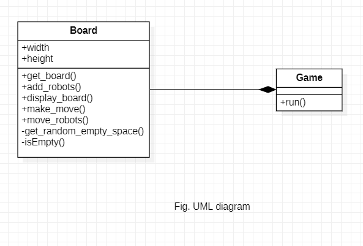

# Hungry Robots


In this small OOPs project, I have designed a small ASCII game called **Hungry Robots**, using Object Oriented Programming.

## Project Procedure
- [Problem Description](#description)
- [Object Oriented Analysis (OOA)](#ooa)
    - [Identifying the objects](#identify1)
- [Object Oriented Design (OOD)](#ood)
    - [High level design](#hlld)
    - [Identifying the Attributes and Methods](#identify2)
    - [UML Diagram](#uml)
- [Object Oriented Programming (OOP)](#oop)
    - [Documentation](#docu)
    - [Examples](#example)

- [Testing](#testing)
    - [Testing objects and methods](#objects)

<a name = "description">
<h1> Problem Description</h1>
</a>

"Hungry Robots" is a small puzzle maze game, in which the player is dropped in a maze with literally hungry robots. The robots are coming to eat the player and his/heronly defense strategy is to make the robots crash into each other. The robots die if they run into another robot. The player wins if he/she can successfully destroy all the robots in the maze.


<a name = "ooa">
<h1> Object Oriented Analysis (OOA)</h1>
</a>
Now that we are familiar with the game's mechanics, let's analyse the problem and look it from the Object Oriented point of view. 

<a name = "identify1">
<h2>Identifying the objects</h2>
</a>

The game will have 2 objects:
- The Board
- The Game itself

**Board** object compose of all the game objects like, player, the robots the map of maze etc. And the object of **Game** class will run our game. 

<a name = "ood">
<h1> Object Oriented Design (OOD)</h1>
</a>
Now let's identify the required class attributes and methods.

<a name = "identify2">
<h2>Identifying the Attributes and Methods</h2>
</a>

### 1. `Board` class
#### Attributes:
**`height`**: The height attribute to set the height of the maze.

**`width`**: The width attribute to set the width of the maze.

#### Methods:
**`get_board()`**: Returns a dictionary that represents the board. The keys are
        (x, y) tuples of integer indices for board positions, the values are
        WALL, EMPTY_SPACE, or DEAD_ROBOT. The dictionary also has the key
        'teleports' for the number of teleports the player has left.

**`add_robots()`**: Adds robots in the board.

**`display_board()`**: Draws the board with ASCII characters on the user's screen.

**`make_move()`**: Takes user's input and moves the player on the board.

**`move_robots()`**: Moves robots depending on the player's current position.

#### Helper Methods
**`__get_random_empty_spaces()`**: A helper method to get random empty spaces on the board.

**`__isEmpty()`**: A helper method to check if position on the board is an empty space.

### 2. `Game` class
#### Methods:
**`run()`**: Prepares the board and runs the game.

<a name = "uml">
<h2>UML Diagram</h2>
</a>

After identifying attributes and methods the UML diagram looks like this:


<a name = "docu">
<h1> Documentation</h1>
</a>

### *class* `Board` 
A class to construct an object of `Board` type.

**Parameters:**\
**height**: ***int type***\
            It represents the height of the board object.

**width**: ***int type***\
            It represents the width of the board object.

**Methods**:\
**get_board()**:\
Returns a dictionary that represents the board where the keys are
        (x, y) tuples of integer indices for board positions and the values are
        WALL, EMPTY_SPACE, or DEAD_ROBOT. The dictionary also has the key
        'teleports' for the number of teleports the player has left.

**add_robots()**: ***arguments: object of Board type***\
Adds robots in the board. Returns a list of tuples of robots' position on the board.

**display_board()**: ***arguments: object of Board type, robots [list of tuples representing robots position], player_pos [a tuple representing player's position]***\
Draws the board with ASCII characters on the user's screen by placing robots at robots' positions and player at players' position.

**make_move()**: ***arguments: object of Board type, robots [list of tuples representing robots' position], player_pos [tuple representing player's position]***\
Asks user's input and moves the player on the board.

**move_robots()**: ***arguments: object of Board type, robots_pos [list of tuples representing robots' position], player_pos [tuple representing player's position]***\
Moves robots depending on the player's current position. Returns a list of (x,y) tuples of new positions of robots.

#### Helper Methods
**__get_random_empty_spaces()**: ***arguments: object of Board type, robots [list of tuples representing robots' position]***
A helper method to get random empty spaces on the board.
Returns a (x,y ) tuple on the board where there is no robot. 

**__isEmpty()**: ***arguments: x, y, robots [list of tuples representing robots' position], object of Board type***
A helper method to check if position on the board is an empty space. Returns True if it is empty space else False.

<a name = "testing">
<h1> Testing </h1>
</a>
<a name = "objects">
<h2> Testing objects and methods</h2>
</a>

Importing `pytest` and `Board` class and creating a fixture `board_obj` of `Board` class
```py
from __future__ import annotations
import pytest
from hungryrobots import Board

@pytest.fixture
def board_obj():
    board_obj = Board(40, 40)
    return board_obj
```
### Testing get_board() method of Board class
```py
# Testing get_board() method of Board class
def test_get_board(board_obj : Board):
    """tests the return type of get_board() mehtod"""
    return_value = board_obj.get_board()
    assert isinstance(return_value, dict)
```
Testing the return type of `get_board()` method of board object. Test passes if returned value is of `dict` type.

### Testing add_robots() method of Board class
```py
# Testing add_robots() method of Board class
def test_add_robots(board_obj: Board):
    """ tests the return type of add_robots() method"""
    board = board_obj.get_board()
    return_value = board_obj.add_robots(board)
    assert isinstance(return_value, list)
    assert isinstance(return_value[0], tuple)
```
Checking the return type of `add_robots()` method. Test passes if return value is object of `list` of `tuples`.

### Testing make_move() method of Board class
```py
def test_make_move(board_obj: Board):
    """ tests the return type of make_move() method"""
    board = board_obj.get_board()
    robots_pos = board_obj.add_robots(board)
    player_pos = board_obj.get_random_empty_space(board, robots_pos)
    try:
        return_value = board_obj.make_move(board, robots_pos, player_pos)
        assert isinstance(return_value, tuple)
    except SystemExit:
        assert True
```
Checks return type of `make_move()` method test passes if return type is a `tuple` or `SystemExit` exception.

### Testing move_robots() method of Board class
```py
# Testing move_robots() method of Board class
def test_move_robots(board_obj: Board):
    """ tests the return type of move_robots() method"""
    board = board_obj.get_board()
    robots_pos = board_obj.add_robots(board)
    player_pos = board_obj.get_random_empty_space(board, robots_pos)
    return_value = board_obj.move_robots(board, robots_pos, player_pos)
    
    assert isinstance(return_value, list)
    assert isinstance(return_value[0], tuple)
```
Checking the return type of `move_robots()` method, test passes if the return type is `list` of `tuples`.
