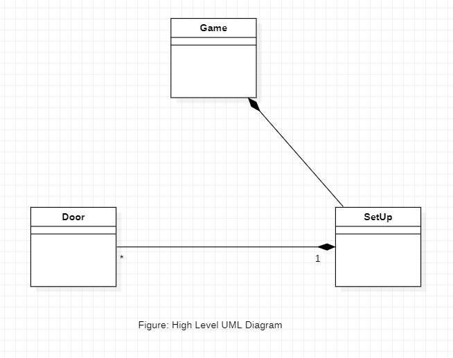
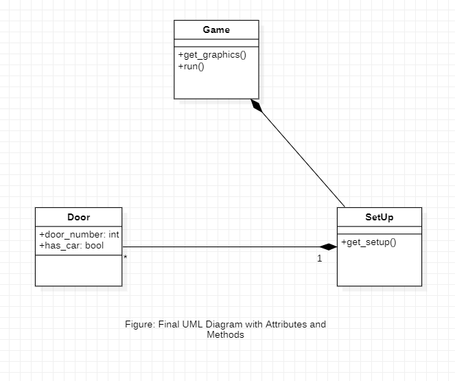
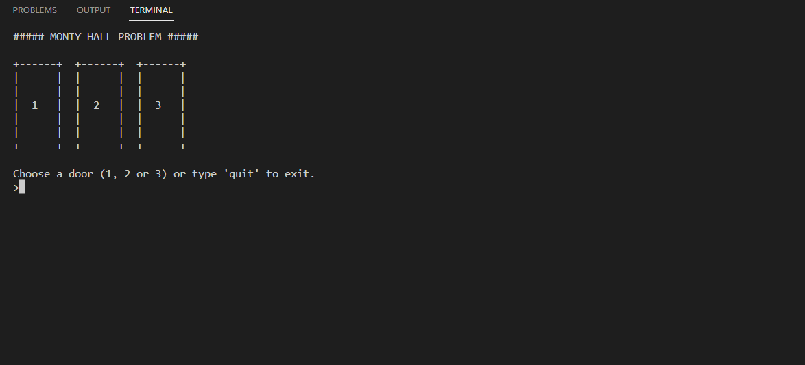
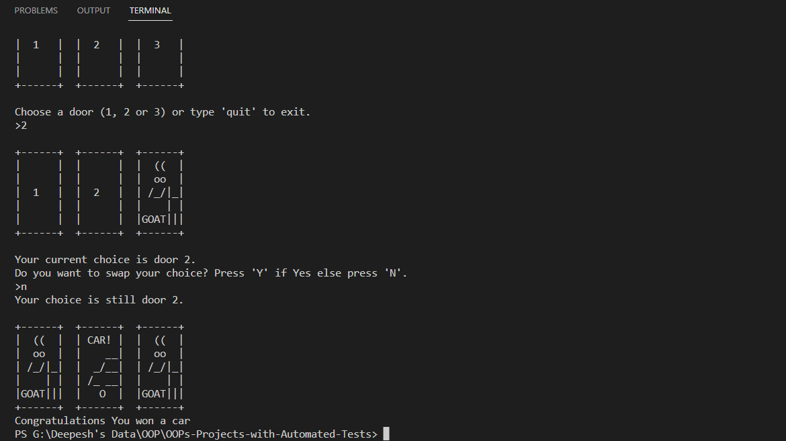
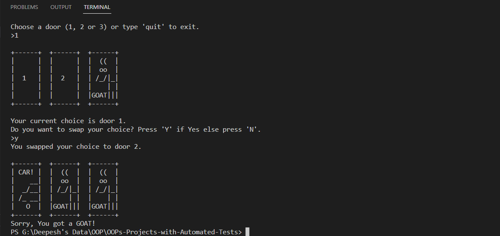
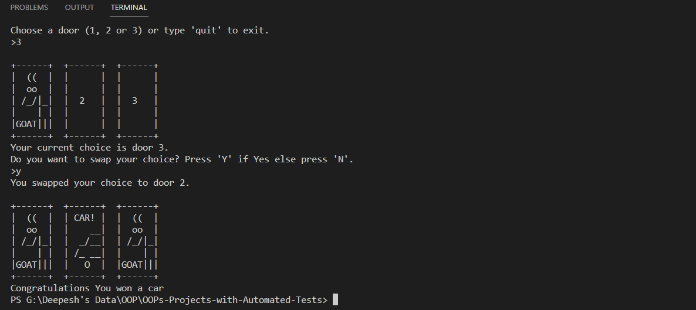

# Monty Hall Problem
<p align ="center">
  
</p>

In this project I have implemented the famous Monty Hall problem using Python OOP. The program is also tested using Python's `pytest` testing framework.

## Project Procedure
- [Problem Description](#description)
- [Object Oriented Analysis (OOA)](#ooa)
    - Identifying the objects and interactions
    - Result of OOA stage
- [Object Oriented Design (OOD)](#ood)
    - High level design
    - Identifying the Attributes and Methods
    - UML Diagram
    - Result of OOD stage
- [Object Oriented Programming (OOP)](#oop)
    - Documentation
    - Examples
- [Functional Programming](#functional)
    - Using Rod and Disc classes
    - Functions in the program
- [Testing](#testing)
    - Testing error raise
    - Testing objects
    - Testing functionality of playgame.py
- [Demonstration](#demo)
- [Things that I learnt from this Project](#lessons)

<a name = "description">
<h1> Problem Description</h1>
</a>

The problem is based on an early 90s television show named *Let's Make a Deal* which was hosted by Monty Hall. This game is actually a puzzle which shows a very interesting usecase of probability. The game is very simple. The player is given tree doors, one of which has a brand new shiny red car and the other two doors have goats behind them (which you might not want to win compared to a brand new shiny red car). So, the player is firstly given a choice to choose a door from the tree doors. The player chooses a door and that door is not opened. The host (who knows which door has a car behind) opens one of the other two doors (not chosen by player), intentionally the one that has a goat behind it.Then there are two closed doors and one open door. The player is then asked if they want to switch to the other door or hold on to the same door they chose in the beginning (Either the door chosen in the beginning has the car or the other door). If the player choose not to switch the doors, all doors are opened and if the door which was chosen by the player has a car behind it they win the car or else they win a goat. Otherwise, if the player choose to switch the doors, again all doors are opened and if the door which the player now switched to has a car they win they car or else they win a goat.


### Magic of Probability
Here is where the probability shows its magic. In the beginning the player chooses at random a door of the three with probability (1/3). Then the host opens the door with goat (which he does knowingly very well). So, when the player is asked to stay or switch the doors, the player should always switch. Because if you do not switch your probability of winning car is still the same as in the beginning that is (1/3), BUT! if you chose to switch the doors, the probability of winning a car becomes (2/3). See the image below.

<p align ="center">
  
</p>


<a name = "ooa">
<h1> Object Oriented Analysis (OOA)</h1>
</a>
Now that we are familiar with the problem, let's analyse the problem and look it from the Object Oriented point of view. Let's identify each object in the game.

## Identifying the objects
The problem has 3 objects:
- Door
- Game setup (Composing of door objects)
- Game (to display the GUI and run the game)

The problem has the following interface:
- User is asked to choose door number
- A door with goat is opened at random
- User is asked to switch the door or stay on same door
- All doors are opened

## Result of the OOA stage
From the OOA stage we have got the description of the system that needs to be built. We determined that we need tree type of objects, Door, A Setup of game that creates initial setup of the puzzle, Game to integrate all the components and run the game and display contents on user's screen.

<a name = "ood">
<h1> Object Oriented Design (OOD)</h1>
</a>
In the OOA stage, we came up with the high level description of the system we are required to build. Now, let's use that description and transform it into requirements for our program.

## High level design
With the above description of the system, our high level design looks like this:

<p align ="center">
  
</p>

We see that, we are required to create:
- `Door` class with attribute to tell if there is a car behind it or a goat.
- `SetUp` class which will use the `Door` class to create objects of doors and randomly set the attribute on door object.
- `Game` class which will use the `SetUp` to show the contents on the user screen and run the game.  

Now, let's move further and see what kind of attributes and methods we can define on these classes.

## Identifying the Attributes and Methods

### 1. `Door` class
#### Attributes:
**`door_number`**: The class `Door` can have a `door_number` to identify the door.

**`has_car`**: The class `Door` can have a `has_car` a boolean type attribute, if set `True` the door will have a car behind if set `False` has goat behind it. 

### 2. `SetUp` class
#### Methods:
**`get_setup()`**: The `SetUp` class needs to have a `get_setup()`method to prepare the initial setup of the puzzle.

### 3. `Game` class
#### Methods:
**`get_graphics()`**: The `Game` class can have a method `get_graphics()` to get the ASCII graphic components to be shown on user's display.

**`run()`**: The `run()` method will use the object of `SetUp` class and run the whole program.

### The updated UML diagram
Now, our UML diagram looks like this:

<p align ="center">
  
</p>

### Result of OOD stage
As a result of OOD stage, we discovered: what classes we need to implement for our system. We also discovered the associated attributes and methods for the respective classes. We now have the requirements for our Object Oriented Programming stage. We can now implement these classes in any Object Oriented language, I used Python.

<a name = "oop">
<h1> Object Oriented Programming (OOP)</h1>
</a>

## Documentation
### *class* `Door` 
A class to construct an object of `Door` type.

**Parameters:**\
**door_number**: ***int type***\
            It represents the door number

**has_car**: ***bool type*** **(Default: *False*)**\
            It is a boolean flag, if set `True` the door object has car else a goat.

### *class* `SetUp`
The **`SetUp`** class uses the `Door` class to create objects of door and prepare the initial setup of the puzzle by randomly setting the `has_car` attribute as `True` for any one door object.

**Methods:**\
**get_setup()**:\
This method uses the `Door` class to create objects of door and prepare the initial setup of the puzzle by randomly setting the `has_car` attribute as `True` for any one door object. It returns a dictionary of door objects.

### *class* `Game`
The **`Game`** uses the object of `SetUp` class to show the components on the display and run the game.

**Methods:**\
**get_graphics()**:\
                This method defines the constant game componenets and returns a dictionary of multiline strings displaying doors with car or goats. 

**run()**:\
            Uses the object of `SetUp` class and creates an interface for the puzzle and run it.

<a name = "testing">
<h1> Testing </h1>
</a>

For testing our program I have used **`pytest`** library. 
#### Testing Door class
```py
import pytest
from montyhall import Door, SetUp, Game

# testing Door class
def test_Door() -> None:
    # creating 3 door objects

    # door1: has_car not passed
    # default: False
    door1 = Door(n=1)

    # door2: has_car == False
    door2 = Door(n=2, has_car=False)
    
    # door3: has_car == True
    door3 = Door(n=3, has_car=True)

    # asserting doo1.has_car == False
    assert False == door1.has_car

    # asserting door2.has_car == False
    assert False == door2.has_car

    # asserting door3.has_car == True
    assert True == door3.has_car
```
In the above test code we are creating three door objects. The `door1` object's `has_car` attribute is `False` by default. For `door2` object we set the `has_car`attribute as `False` explicitly and for `door3` object we set the `has_car` attribute as `True` explicitly and we test the attributes on each of these objects.

#### Testing SetUp class
```py
# testing SetUp class
def test_SetUp() -> None:
    # instantiating a SetUp object
    s = SetUp()

    # getting setup
    setup = s.get_setup()

    # asserting setup is instance of dict
    assert isinstance(setup, dict)

    # getting values in setup dict
    values = [x.has_car for x in setup.values()]

    # asserting there are 2 doors with Goat
    assert 2 == values.count(False)

    # asserting there is only 1 door with car
    assert 1 == values.count(True)
```
In the above test code, we are testing the `SetUp` class. We create an object of `SetUp` class and call the `get_setup()` method. We test following things:
- If the return type of the `get_setup` method is `dict` type
- Count of doors with Goat are 2
- Count of doors with Car is 1

<a name='demo'>
<h1> Demonstration </h1>
</a>
Given below are some of the snapshots of the final output of the progam.

## The initial state of the game
This is how the initial interface of the game looks.



## Choosing a Door
We are asked to choose a door, we choose door 2 in the snapshot shown below.


## Swap or Stay?
Then we are asked to swap doors or stay on the same. In the snapshot below, we chose to stay and fortunately won the car. But it is not always a win.



## Swapping Looses
In the snapshot below, we chose to swap doors and we lost the game with the message "You got a GOAT!"



## Swapping Wins
In the snapshot below, we chose to swap doors and we won the game with the message "Congratulations you won a car"



<a name = 'lessons'>
<h1> Things that I learnt from this project</h1>
</a>

I have acquired the following skills from this project:
- **Object Oriented Designing**: I have learnt how to approach an OOPs project as a step-by-step procedure, by first analysing the problem at hand from object oriented point of view, finding the objects and the relations between those objects.

- **UML Diagrams**: I have learnt how to draw the basic UML diagrams before jumping into programming step. UML diagrams do really makes implementation easy, when we sit and write the code for the Object Oriented Programming project.

- **Exception Handling**: In this project I have used some of the exception classes and also coded my own simple exception `InvalidMove`. Doing this I have developed a good understanding of the concept of Exception Handling.

- **Extending built-in types**: In my project I extended the built-in `list` type for our new class `Rod`. Which makes things quite easy.

- **Unit Testing with `pytest` library**: The most valuable skill I have learnt is unit testing using `pytest` library. Testing my code pointed out a few loopholes in my code which I fixed and ensured that my code is free of bugs.

- **Using functional programming to make a highly interactive command line display**: I learnt how we can make our command line prompt so interactive and also display our objects in such easy way.
