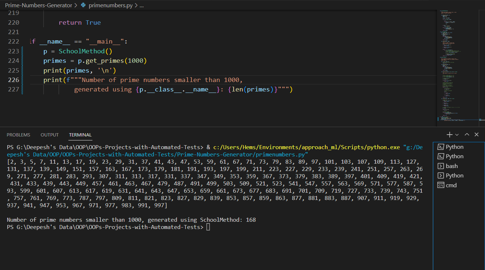
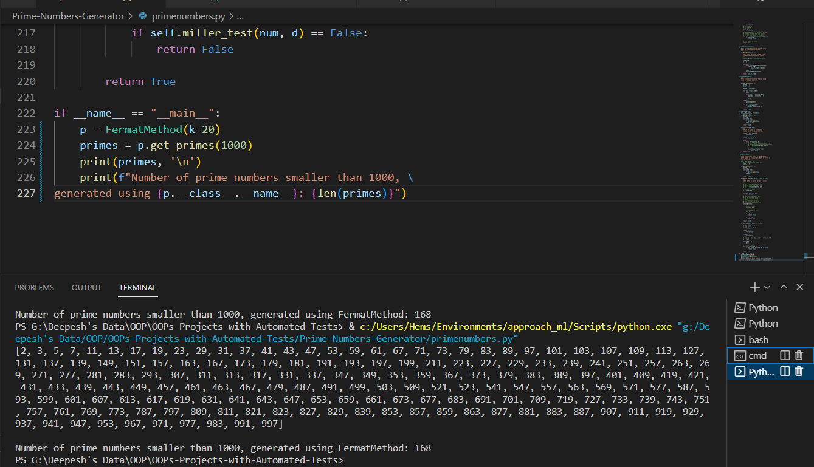
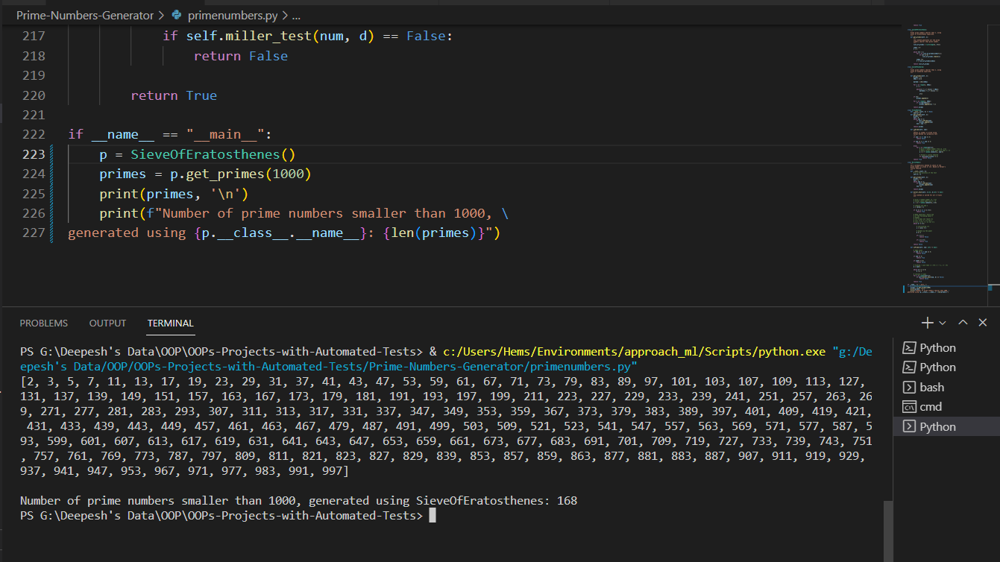
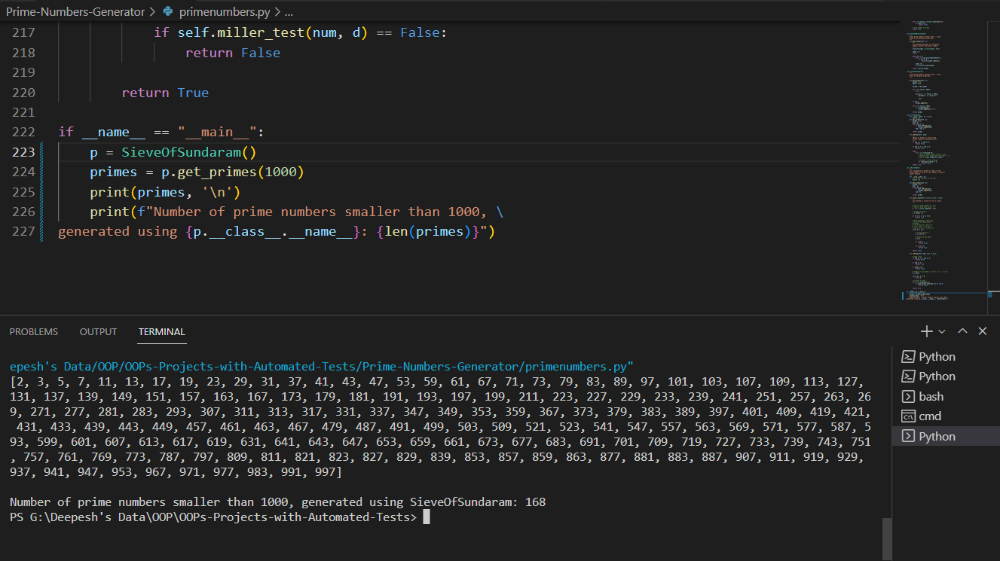
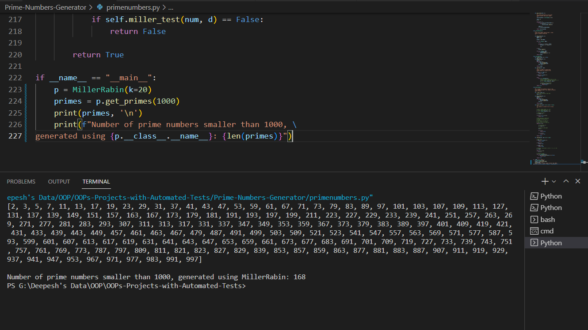

# Prime Numbers Generator
In this OOP project, I have implemented various primality test algorithms like, Old School method, Fermat Method, Sieve of Eratosthenes, Sieve of Sundaram and Miller Rabin primality test, to generate prime numbers. And also tested the program with the help of `pytest` library.

## Project Procedure
- [Problem Description](#description)
    - Primality Test Algorithms
- [Object Oriented Design (OOD)](#ood)
    - UML Diagram
- [Object Oriented Programming (OOP)](#oop)
    - Documentation
    - Examples
- [Testing](#testing)
    - Testing Rod class
    - Testing Abacus Class

- [Demonstration](#demo)
- [Things that I learnt from this Project](#lessons)

<a name = "description">
<h1> Problem Description</h1>
</a>

A prime number is a natural number greater than 1 that has no positive divisors other than 1 and itself. Examples of the first few prime numbers are {2, 3, 5, …}. There is no algorithm to predict a prime number, the numbers are tested one at a time if they are prime or not using some primality test algorithms, such as:
- School Method
- Fermat Method
- Sieve of Eratosthenes
- Sieve of Sundaram
- Millar Rabin Primality Test

### Primality Test Algorithms
1. **School Method**: It is the most simple solution, we iterate through all the numbers from 2 to n-1 and for every number we check if it divides n. If we find any number that divides, we return `False` meaning the number failed the primality test. Instead of checking till `n`, we can check till `√n` because a larger factor of `n` must be a multiple of a smaller factor that has been already checked.

Time Complexity: O(√n)

2. **Fermat Method**: It is a probabilistic method, it tests if a number is probably a prime or a composite number. For prime number it will always return `True` but for composite number it may return either `True` or `False`, hence, this method is not very accurate. However, if we increase the iterations for test `k` the algorithm gets more accurate.

    **Algorithm:**
    1)  Repeat following k times:\
        a) Pick a randomly in the range [2, n - 2]\
        b) If gcd(a, n) ≠ 1, then return False\
        c) If an-1 &nequiv; 1 (mod n), then return False
    2) Return True [probably prime].

    Where, Higher value of k indicates, probability of correct results for composite inputs become higher and hence, the tests for prime numbers are more accurate.

3. **Sieve of Eratosthenes**: The Sieve of Eratosthenes is one of the most efficient ways to find all primes smaller than `n`, when `n` is smaller than 10 million or so.

    **Algorithm:**
    1) We create a list of all numbers from 2 to n. Let `n = 10` for simplicity.\
        [2, 3, 4, 5, 6, 7, 8, 9, 10]\

    Then, we repeat the following steps until the square of current element is smaller than the input `n`.

    2) n = 10, current element = 2, Since, 2*2 < 10 we remove all the numbers that are multiples of 2, except itself.\
        [2, 3, 5, 7, 9]

    3) n = 10, current element = 3, Since, 3*3 < 10 we remove all the number that are multiples of 3, except itself.\
        [2, 3, 5, 7]

    4) n = 10, current element = 5, Since, 5*5 > 10 we stop here, and the elements in the list are the prime numbers less than 10.\
        Answer: [2, 3, 5, 7]

4. **Sieve of Sundaram**: Sieve of Sundaram is more efficient method than Sieve of Eratosthenes method. It allows us to find the prime numbers smaller than 1 Billion.

    **Algorithm:**
    1) In general Sieve of Sundaram, produces primes smaller than (2*x + 2) for a number given number x. Since we want primes smaller than n, we reduce n to half. We call it `nNew`.\
        `nNew = n//2`\
        For example, if n = 102, then nNew = 50. if n = 103, then nNew = 51

    2) Create an array `marked[n]` that is going to be used to separate numbers of the form (i + j + 2ij) from others where  (1 <= i <= j)

    3) Initialize all entries of `marked` as 0 (False).

    4) Mark all numbers of the form (i + j + 2ij) as 1 (True) where (1 <= i <= j)\
        Loop for i=1 to `nNew`\
        a) j = i\
        b) Loop while (i + j + 2*i*j)\  
            if 2 then append 2 as first prime.

    6) Remaining primes are of the form (2i + 1) where i is index of `NOT marked` numbers. So print (2i + 1) for all i such that `marked[i]` is 0 (False).\

5. **Miller Rabin Primality Test**: This algorithm, is more advanced form of Fermat Method of primality test. It is based on the same Fermat's Little Theorem. It return False for composite prime and True for prime numbers.

    **Algorithm:**

    **isPrime(n : int, k: int) -> bool**
    1) Handle base cases for `n<3`
    2) If n is even, return `False`.
    3) Find an odd number d such that `n-1` can be written as `d*2r`.\
    Note that since `n` is odd, `(n-1)` must be even and `r` must be greater than `0`.
    4) Do following k times\
        `if (millerTest(n, d) == False)`\
            `return False`
    5) Return `True`.

    This `isPrime()` method is called for all `k` trials. It returns `False` if n is composite and returns `True` if n is probably prime. Here, `d` is an odd number such that `d*2r = n-1` for some `r >= 1`.
    
    **miller_test(n: int, d: int) -> bool**
    1) Pick a random number 'a' in range `[2, n-2]`
    2) Compute: `x = a^d % n`
    3) If `x == 1 or x == n-1`, return `True`.

    4) Do following while d doesn't become `n-1`.\
        a) x = (x*x) % n.\
        b) If (x == 1) return False.\
        c) If (x == n-1) return True. 

<a name = "ood">
<h1> Object Oriented Design (OOD)</h1>
</a>

In this project we are going to implement a class for each of the primality test algorithms mentioned above. Each class will consist of a `get_primes()` method and a `isPrime()` method. `get_primes()` method uses the algorithm defined in `isPrime()` method to check if a number is prime or not and return a list of prime numbers smaller than a given number.

## Identifying the Attributes and Methods
### 1. `SchoolMethod` class
#### Methods:
**`get_primes()`**: This method returns the list of all prime numbers smaller than the given number with the help of `isPrime()` method.

**`isPrime()`**: This method defines the algorithm we are using for testing if the number is prime or not. In case of `SchoolMethod` class we will define School Method of primality test in this method.

### 2. `FermatMethod` class
#### Attributes:
**`k`**: It is the number of iterations to run the Fermat Test on a number. Greater the `k` more will be the accuracy.

#### Methods:
**`get_primes()`**: This method returns the list of all prime numbers smaller than the given number with the help of `isPrime()` method.

**`isPrime()`**: This method defines the algorithm we are using for testing if the number is prime or not. In case of `FermatMethod` class we will define Fermat Method of primality test in this method.

### 3. `SieveOfEratosthenes` class
#### Methods:
**`get_primes()`**: This method returns the list of all prime numbers smaller than the given number using Sieve of Eratosthenes algorithm.

### 4. `SieveOfSundaram` class
#### Methods:
**`get_primes()`**: This method returns the list of all prime numbers smaller than the given number using Sieve of Sundaram algorithm.

### 5. `MillerRabin` class
#### Attributes:
**`k`**: It is the number of iterations to run the Miller Test on a number. Greater the `k` more will be the accuracy.

#### Methods:
**`get_primes()`**: This method returns the list of all prime numbers smaller than the given number with the help of `isPrime()` method.

**`isPrime()`**: This method will run the `miller_test()` method for `k` iterations for a given number.

**`miller_test()`**: This method consists of the definition of Miller Rabin primality test algorithm.

### The UML diagram
Now, our UML diagram looks like this:


Now, we can implement these classes and algorithms in Python.

<a name = "oop">
<h1> Object Oriented Programming (OOP)</h1>
</a>

## Documentation
### *class* `SchoolMethod`
This is a class for School Method of primality test.

**Methods:**\
**get_primes()**: ***arguments: n (int)***\
A method to get the list of all prime numbers smaller than a number `n`.

**isPrime()**: ***arguments: num (int)***\
Takes a number and returns a boolean value; `True` if the number is prime else `False`. 

### *class* `FermatMethod`
This is a class to generate prime numbers using Fermat Method of primality test.

**Methods:**\
**get_primes()**: ***arguments: n (int)***\
A method to get the list of all prime numbers smaller than a number `n`.

**isPrime()**: ***arguments: num (int)***\
Takes a number and returns a boolean value; `True` if the number is "probably" prime else `False`. 

### *class* `SieveOfEratosthenes`
This is a class for Sieve of Eratosthenes Method to generate prime numbers.

**Methods:**\
**get_primes()**: ***arguments: n (int)***\
A method to get the list of all prime numbers smaller than a number `n`.

### *class* `SieveOfSundaram`
This is a class for Sieve of Sundaram Method to generate prime numbers.

**Methods:**\
**get_primes()**: ***arguments: n (int)***\
A method to get the list of all prime numbers smaller than a number `n`.

### *class* `MillerRabin`
This is a class to generate prime numbers using Miller Rabin Method of primality test.

**Parameters:**\
**k**: ***int type***\
Number of iterations for primality test. More iterations means more accurate test for a number.

**Methods:**\
**get_primes()**: ***arguments: n (int)***\
A method to get the list of all prime numbers smaller than a number `n`.

**miller_test()**: ***arguments: n (int)***\
This method defines the Miller-Rabin primality test algorithm. It takes a number `n` and returns `True` if number is prime (probably) or `False` if number is composite prime or not prime.

**isPrime()**: ***arguments: num (int)***\
Takes a number and returns a boolean value; `True` if the number is "probably" prime else `False`. 

<a name = "testing">
<h1> Testing </h1>
</a>

For testing our program I have used **`pytest`** library. 
### Testing the `primenumbers` module
```py
# Testing primenumbers module
import pytest
from primenumbers import (SchoolMethod, FermatMethod, 
SieveOfEratosthenes, SieveOfSundaram, MillerRabin)

# creating fixtures of each primality test classes
@pytest.fixture
def school_method_obj() -> SchoolMethod:
    sm = SchoolMethod()
    return sm

@pytest.fixture
def fermat_method_obj() -> SchoolMethod:
    fm = FermatMethod(k=50)
    return fm

@pytest.fixture
def sieve_of_eratosthenes_obj() -> SchoolMethod:
    soe = SieveOfEratosthenes()
    return soe

@pytest.fixture
def sieve_of_sundaram_obj() -> SchoolMethod:
    sos = SieveOfSundaram()
    return sos

@pytest.fixture
def miller_rabin_obj() -> SchoolMethod:
    mr = MillerRabin(k=50)
    return mr

# Testing SchoolMethod class
@pytest.mark.parametrize("numbers", [10, 100, 1000, 10000, 100000])
def test_SchoolMethod(school_method_obj: SchoolMethod, numbers) -> None:
    list_of_primes = school_method_obj.get_primes(numbers)
    
    if numbers == 10:
        assert 4 == len(list_of_primes)
    if numbers == 100:
        assert 25 == len(list_of_primes)
    if numbers == 1000:
        assert 168 == len(list_of_primes)
    if numbers == 10000:
        assert 1229 == len(list_of_primes)
    if numbers == 100000:
        assert 9592 == len(list_of_primes)

# Testing FermatMethod class
@pytest.mark.parametrize("numbers", [10, 100, 1000, 10000])
def test_FermatMethod(fermat_method_obj: FermatMethod, numbers) -> None:
    list_of_primes = fermat_method_obj.get_primes(numbers)
    
    if numbers == 10:
        assert 4 == len(list_of_primes)
    if numbers == 100:
        assert 25 == len(list_of_primes)
    if numbers == 1000:
        assert 168 == len(list_of_primes)
    if numbers == 10000:
        assert 1229 == len(list_of_primes)

# Testing SieveOfEratosthenes class
@pytest.mark.parametrize("numbers", [10, 100, 1000, 10000, 100000])
def test_SieveOfEratosthenes(sieve_of_eratosthenes_obj: SieveOfSundaram, numbers) -> None:
    list_of_primes = sieve_of_eratosthenes_obj.get_primes(numbers)
    
    if numbers == 10:
        assert 4 == len(list_of_primes)
    if numbers == 100:
        assert 25 == len(list_of_primes)
    if numbers == 1000:
        assert 168 == len(list_of_primes)
    if numbers == 10000:
        assert 1229 == len(list_of_primes)
    if numbers == 100000:
        assert 9592 == len(list_of_primes)

# Testing SieveOfSundaram class
@pytest.mark.parametrize("numbers", [10, 100, 1000, 10000, 100000])
def test_SieveOfSundaram(sieve_of_sundaram_obj: SieveOfSundaram, numbers) -> None:
    list_of_primes = sieve_of_sundaram_obj.get_primes(numbers)
    
    if numbers == 10:
        assert 4 == len(list_of_primes)
    if numbers == 100:
        assert 25 == len(list_of_primes)
    if numbers == 1000:
        assert 168 == len(list_of_primes)
    if numbers == 10000:
        assert 1229 == len(list_of_primes)
    if numbers == 100000:
        assert 9592 == len(list_of_primes)

# Testing MillerRabin class
@pytest.mark.parametrize("numbers", [10, 100, 1000, 10000])
def test_MillerRabin(miller_rabin_obj: MillerRabin, numbers) -> None:
    list_of_primes = miller_rabin_obj.get_primes(numbers)
    
    if numbers == 10:
        assert 4 == len(list_of_primes)
    if numbers == 100:
        assert 25 == len(list_of_primes)
    if numbers == 1000:
        assert 168 == len(list_of_primes)
    if numbers == 10000:
        assert 1229 == len(list_of_primes)
```
In the above code, we are testing whole `primenumbers` module by unit testing of each classes. Firstly, we are creating pytest fixtures for instantiating classes. Notice, we have passed the parameter `k` for `FermatMethod` class and `MillerRabin` class. And then we are testing each classes by generating prime numbers for values (10, 100, 1000, 10000, 100000*) and checking length of lists for each input. For example: for input 10, the number of prime numbers smaller than 10 are 4. Similarly, for 100 number of prime numbers smaller than 100 are 25. All tests pass if length of the generated prime number lists is equal to the given number.

*Note: We are not testing classes `FermatMethod` and `MillerRabin` for value 100000 because it is very time consuming.

<a name='demo'>
<h1> Demonstration </h1>
</a>
Given below are some of the snapshots of the final output of the progam.

### School Method of primality test
Using School Method of primality test algorithm to generate prime numbers smaller than 1000.




### Fermat Method of primality test
Using Fermat Method of primality test algorithm to generate prime numbers smaller than 1000. 




### Sieve of Eratosthenes
Using Sieve of Eratosthenes algorithm to generate prime numbers smaller than 1000.




### Sieve of Eratosthenes
Using Sieve of Sundaram algorithm to generate prime numbers smaller than 1000.




### Miller Rabin primality test
Using Miller Rabin primality test algorithm to generate prime numbers smaller than 1000.



<a name = 'lessons'>
<h1> Things that I learnt from this project</h1>
</a>

I have learnt following things from this project:
- **UML Diagrams**: I have learnt how to draw the basic UML diagrams before jumping into programming step. UML diagrams do really makes implementation easy when we sit and write the code for the Object Oriented Programming project.

- **Primality Test Algorithms**: Prime number genrators are helful for **cryptography** there is no such algorithm to predict prime numbers. Only way to generate prime numbers is by using primality test, by testing each number using primality test one by one. In this project I have learnt various primality test algorithms like, School Method, Fermat Method, Sieve of Eratosthenes and more advanced version of it Sieve of Sundaram and the more advanced version of Fermat Primality test the Miller Rabin method.

- **Unit Testing with `pytest` library**: The most valuable skill I have learnt is unit testing using `pytest` library. Testing my code pointed out a few loopholes in my code which I fixed and ensured that my code is free of bugs.