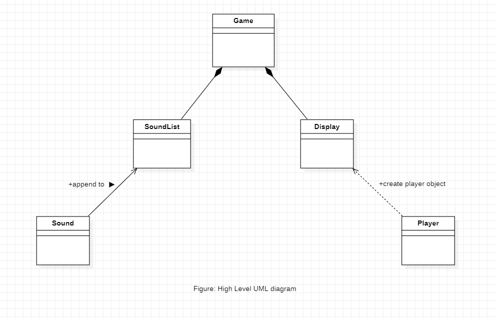
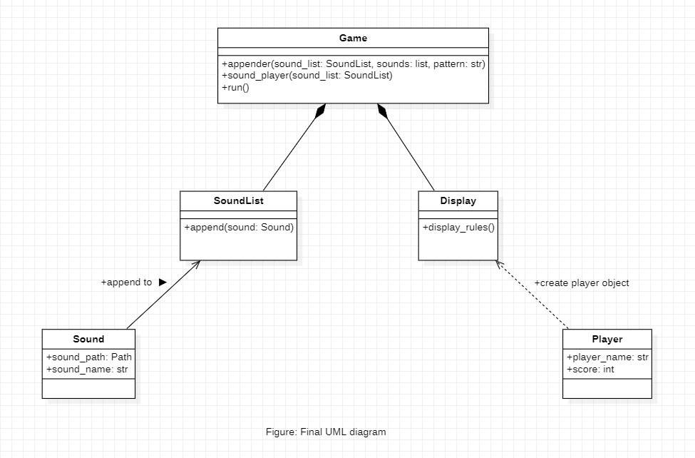

# Repeat After Me
In this small OOPs project, I have created a game called "Repeat After Me" using Object Oriented Programming. Also, tested the functionality of program with the help of `pytest` library.

## Project Procedure
- [Problem Description](#description)
- [Object Oriented Analysis (OOA)](#ooa)
    - Identifying the objects and interactions
    - Result of OOA stage
- [Object Oriented Design (OOD)](#ood)
    - High level design
    - Identifying the Attributes and Methods
    - UML Diagram
    - Result of OOD stage
- [Object Oriented Programming (OOP)](#oop)
    - Documentation
    - Examples
- [Functional Programming](#functional)
    - Using Rod and Disc classes
    - Functions in the program
- [Testing](#testing)
    - Testing error raise
    - Testing objects
    - Testing functionality of playgame.py
- [Demonstration](#demo)
- [Things that I learnt from this Project](#lessons)

<a name = "description">
<h1> Problem Description</h1>
</a>

In this small game the player is given a string pattern of random letters from a set (A, S, D, F) along with their sounds. Then the player is asked to repeat the same pattern of string. If the player inputs a correct pattern, string pattern keeps growing with addition of one random letter from the set. The player is offered one point for each correct answer. If the player inputs wrong pattern, they lose and the game stops showing the total score of the player.

<a name = "ooa">
<h1> Object Oriented Analysis (OOA)</h1>
</a>
Now that we are familiar with the problem, let's analyse the problem and look it from the Object Oriented point of view. This stage is known as Object Oriented Analysis (OOA). We just simply see the problem and identify the objects and the interface of the problem.

## Identifying the objects
The problem has 5 objects:
- Sound
- List of Sounds
- Player
- Game
- Display

The problem has the following interface:
- Sound is added in a List of Sounds.
- List of Sounds keeps the string pattern.
- The player is asked to input the pattern.
- If the pattern is correct, the List of Sounds is updated.
- If the pattern is incorrect, the player loses.
- Goal is to memorize the pattern and keep entering right pattern to score points.

## Result of the OOA stage
From the OOA stage we have got the description of the system that needs to be built. We determined that we need five type of objects, Sound, a List of Sounds to hold Sound type objects, Player to save the state of the player, Game to integrate all the components and run the game and a Display object to display contents on user's screen.

<a name = "ood">
<h1> Object Oriented Design (OOD)</h1>
</a>
In the OOA stage, we came up with the high level description of the system we are required to build. Now, let's use that description and transform it into requirements for our program.

## High level design
With the above description of the system, our high level design looks like this:


We see that, the `Sound` class is directly associated with the `SoundList` class, and The `Player` class depends on the `Display` class. And then the `SoundList` class and the `Display` classes are in composite relation with the `Game` class 

Now, let's move further and see what kind of attributes and methods we can define on these classes.

## Identifying the Attributes and Methods

### 1. `Sound` class
#### Attributes:
**`sound_path`**: The class `Sound` can have a `sound_path` attribute to store the path of the sound file.

**`sound_name`**: The class `Sound` can have a `sound_name` attribute to identify what sound it is. 

### 2. `SoundList` class
#### Methods:
**`append()`**: The `SoundList` class needs to have a `append()`method to append the object of `Sound` type.

### 3. `Player` class
#### Attributes:
**`player_name`**: The `Player` class can have a `player_name` attribute to store the name of the player.

**`score`**: The `Player` class can also have a `score` attribute to store the current score of the player.

### 4. `Display` class
#### Methods:
**`display_rules()`**: The `Display` class can have a `display_rules()` method to display the rules on the user screen, and ask player to enter their name. It will return a player object with its name.

### 5. `Game` class
#### Methods:
**`appender()`**: The `Game` class can have a `appender()` method to append a random letter after each correct input from player. It updates the `SoundList` object.

**`sound_player()`**: The `sound_player()` method to play the sound of each `Sound` object stored in the `SoundList` object.

**`run()`**: The `run()` method will integrate each of the objects and run the whole program.

### The updated UML diagram
Now, our UML diagram looks like this:



### Result of OOD stage
As a result of OOD stage, we discovered: what classes we need to implement for our system. We also discovered the associated attributes and methods for the respective classes. We now have the requirements for our Object Oriented Programming stage. We can now implement these classes in any Object Oriented language, we will use Python.

<a name = "oop">
<h1> Object Oriented Programming (OOP)</h1>
</a>

## Documentation
### *class* `Sound(sound_path: Path, sound_name: str)` 
A class to construct an object of `Sound` type.

**Parameters:**\
**sound_path**: ***str type or Path object***\
            It represents the path of the sound object.

**sound_name**: ***str type***\
            It represents the name of the sound object.

### *class* `SoundList(sound: Sound)`
The **`SoundList`** class extends the buit-in `List` class, and stores only object of `Sound` type.

**Methods:**\
**append()**: ***sound: Sound type***\
            Appends the object of `Sound` to self.

### *class* `Player(name: str)` 
A class to construct an object of `Player` type.

**Parameters:**\
**name**: ***str type***\
            It represents the name of the player.
            
**Attributes**:\
**score**: ***int type***\
            represents the score of the player.

### *class* `Display()`
The **`Display`** creates an object of `Display` type having method to display the rules and ask player for their name to create an objec of `Player` class.

**Methods:**\
**display_rules()**:\
            Displays the rules on user's screen and asks user for their name to create a Player object.

### *class* `Game()`
The **`Game`** creates a composite object of all the other classes in the program. It takes the objects of each class and run the game.

**Methods:**\
**appender()**: ***sound_list: SoundList, sounds: list, pattern: str***\
                This method appends the random sound objects form `sounds` to the `sound_list` and also updates the `pattern`. 
            
**sound_player()**: ***sound_list: SoundList***\
                This method goes over each sound object in the `sound_list` and plays its associated sound located at the `sound_path`.

**run()**:\
            Combines all the objects in the program and run the `Game` object.

### Exceptions
#### `TypeError`
This exception is raised when a parameter is passed in the `SoundList` class which is not of type `Sound`.

## Examples:
Appending `Sound` object in a `SoundList`.
```py
# instantiating object of Sound class
# passing the sound_path and sound_name parameters
s1 = Sound(sound_path= "Repeat-After-Me/sounds/soundA.wav", sound_name='A')

# instantiating object of SoundList
sl = SoundList()

# appending s1 in sl
sl.append(s1)
```

<a name = "testing">
<h1> Testing </h1>
</a>

For testing our program I have used **`pytest`** library. 
### Testing error raise
```py
import pytest
from repeatafterme import Sound, SoundList, Player, Display, Game

# Testing Error
@pytest.fixture
def sound_list() -> None:
    sl = SoundList()

    return sl
```
We create a fixture to instantiate an object of class `SoundList` for checking if the SoundList class raise an error if we append an object of any kind other than `Sound` type.

#### Testing TypeError
```py
def test_SoundList_classV1(sound_list: SoundList) -> None:
    try:
        sound_list.append(12)

    except TypeError:
        assert True
```
The above code will test if appending an `int` type object will raise a `TypeError` or not. Since, we expect our test to raise the error, it will pass if the `TypeError` does raise.

#### Testing SoundList class's append() method
```py
def test_SoundList_classV2(sound_list: SoundList) -> None:
    sound = Sound("Repeat-After-Me/sounds/soundA", 'A')
    sound_list.append(sound)

    assert isinstance(sound_list[-1], Sound)
```
The above code tests, if the object appended to the `SoundList` type object is an instance of `Sound` class. This test will pass if the object is an instance of `Sound` class.

#### Testing Display class's display_rules() method
```py
def test_Display_class() -> None:
    d = Display
    player = d.display_rules(d)

    assert isinstance(player, Player)
    assert isinstance(player.player_name, str)
```
The above code tests, if the return type of the `display_rules()` method is an instance of `Player` class and if the object is an instance of `Player` class, check if the `player_name` is `str` type.

#### Testing the `appender()` method of Game class
```py
def test_appender_method(sound_list: SoundList) -> None:
    sl = sound_list
    sound_A = Sound(sound_path="Repeat-After-Me/sounds/soundA.wav", sound_name='A')
    sound_S = Sound(sound_path="Repeat-After-Me/sounds/soundS.wav", sound_name='S')
    sound_D = Sound(sound_path="Repeat-After-Me/sounds/soundD.wav", sound_name='D')
    sound_F = Sound(sound_path="Repeat-After-Me/sounds/soundF.wav", sound_name='F')

    sounds = [sound_A, sound_S, sound_D, sound_F]
    g = Game
    pattern = ""
    p = g.appender(g, sl, sounds, pattern)

    assert len(sound_list) != 0
    assert isinstance(p, str)
    assert p[-1] == sound_list[-1].sound_name

```
The above test code, tests the `appender()` method of Game class. It tests, after appending a sound object to the `sound_list` the length of the `sound_list` is not zero (i.e., the sound list is not empty). It also checks if the return type of the object returned by the `appender()` method is `str` type (which is a pattern string). And it checks if the last last letter added to the `pattern` is same as the name of the sound object in the `sound_list`.

<a name='demo'>
<h1> Demonstration </h1>
</a>
Given below are some of the snapshots of the final output of the progam.

#### The initial state of the game
Here, I have first shown the rules of the game. and a small Menu, to ask the player for the level of difficulty.


#### The state after the user inputs the level of difficulty
After the user inputs the level of difficulty (3 in the snapshot below) the initial state of the game is diplayed as shown below.


#### The final state of the game when user successfully solves the puzzle
After the user successfully solves the puzzle in the given number of moves, by giving their response through keyboard input. They see the following display.


and the game exits successfully with SystemExit.

<a name = 'lessons'>
<h1> Things that I learnt from this project</h1>
</a>

I have acquired the following skills from this project:
- **Object Oriented Designing**: I have learnt how to approach an OOPs project as a step-by-step procedure, by first analysing the problem at hand from object oriented point of view, finding the objects and the relations between those objects.

- **UML Diagrams**: I have learnt how to draw the basic UML diagrams before jumping into programming step. UML diagrams do really makes implementation easy, when we sit and write the code for the Object Oriented Programming project.

- **Exception Handling**: In this project I have used some of the exception classes and also coded my own simple exception `InvalidMove`. Doing this I have developed a good understanding of the concept of Exception Handling.

- **Extending built-in types**: In my project I extended the built-in `list` type for our new class `Rod`. Which makes things quite easy.

- **Unit Testing with `pytest` library**: The most valuable skill I have learnt is unit testing using `pytest` library. Testing my code pointed out a few loopholes in my code which I fixed and ensured that my code is free of bugs.

- **Using functional programming to make a highly interactive command line display**: I learnt how we can make our command line prompt so interactive and also display our objects in such easy way.
