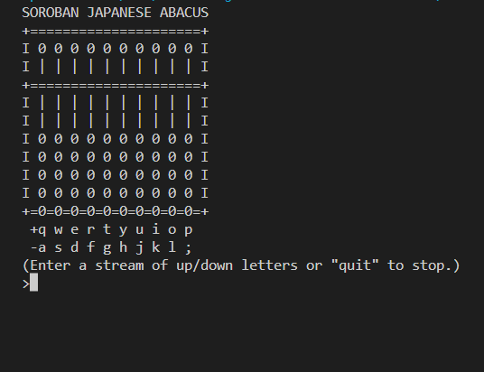
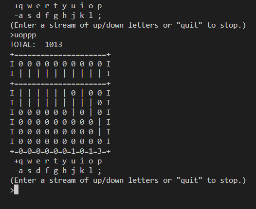
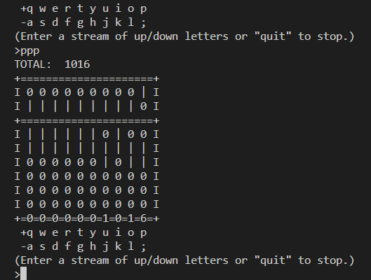

# Soroban Japanese Abacus
In this OOP project, I have implemented Soroban Japanese Abacus using Object Oriented Programming and also tested the functionality of program with the help of `pytest` library.

## Project Procedure
- [Problem Description](#description)
- [Object Oriented Analysis (OOA)](#ooa)
    - [Identifying the objects](#identify1)
- [Object Oriented Design (OOD)](#ood)
    - [High level design](#hld)
    - [Identifying the Attributes and Methods](#identify2)
    - [UML Diagram](#uml)
- [Object Oriented Programming (OOP)](#oop)
    - [Documentation](#docu)
    - [Examples](#example)
- [Testing](#testing)
    - [Testing Rod class](#test1)
    - [Testing Abacus Class](#test2)
- [Demonstration](#demo)
- [Things that I learnt from this Project](#lessons)

<a name = "description">
<h1> Problem Description</h1>
</a>

An abacus, also called a counting frame, is a calculating tool used in many cultures long before electronic calculators were invented. Figure below, shows the Japanese version of abacus called Soroban.Each wire represents a place in a positional numeral system, and the beads on the wire represent the digit at that place. For example, a soroban with two beads moved over on the rightmost wire and three beads moved over on the second-to-rightmost wire would represent the number 32.


<a name = "ooa">
<h1> Object Oriented Analysis (OOA)</h1>
</a>
Now that we are familiar with the problem, let's analyse the problem and look it from the Object Oriented point of view. 

<a name = "identify1">
<h2> Identifying the objects</h2>
</a>

The problem has 2 objects:
- Rods / Wires
- Abacus (Composing of Rod objects)

The problem has the following interface:
- There are 10 Rod objects
- Each Rod consists of 4 Earth beads (beads that are below the horizontal separator in the image) and 1 Heaven bead (bead that is above the horizontal separator in the image shown above)
- The beads are moved up and down

### Result of the OOA stage
From the OOA stage we have got the description of the system that needs to be built. We determined that we need two type of objects; Rod and Abacus.

<a name = "ood">
<h1> Object Oriented Design (OOD)</h1>
</a>
In the OOA stage, we came up with the high level description of the system we are required to build. Now, let's use that description and transform it into requirements for our program.

<a name = "hld">
<h2>High level design</h2>
</a>

With the above description of the system, our high level design looks like this:


Our high level design shows two classes, `Rod` and `Abacus`. And there is a composite relation between the two classes, because the object of `Abacus` class will consist of 10 `Rod` type objects. 

Now, let's move further and see what kind of attributes and methods we can define on these classes.

<a name = "identify2">
<h2>Identifying the Attributes and Methods</h2>
</a>

### 1. `Rod` class
#### Attributes:
**`name`**: The `name` attribute to identify the rod object.

**`earth`**: The class `Rod` can have a `earth` attribute to store the state of earth rows.

**`heaven`**: The class `Rod` can have a `heaven` attribute to store the state of heaven row.

**`mapping`**: A dict type mapping to map the `name` of the rod with its respective power of 10. For example: rod 'q' is mapped with 10e+9, rod 'w' is mapped with 10e+8 and so on.

#### Methods:
**`move_beads_up()`**: The `Rod` class needs to have a `move_beads_up()`method to move the beads on the given rod **up**.

**`move_beads_down()`**: Similarly, `Rod` class should also have a `move_beads_down()`method to move the beads on the given rod **down**.

### 2. `Abacus` class
#### Attributes:
Since, our `Abacus` is composed of 10 rod type objects, we instantiate 10 objects of `Rod` class to form our abacus.\
**`rodQ`**: An object of `Rod` class to represent the rod 'Q' in the `Abacus`.\
**`rodW`**: An object of `Rod` class to represent the rod 'W' in the `Abacus`.\
**`rodE`**: An object of `Rod` class to represent the rod 'E' in the `Abacus`.\
**`rodR`**: An object of `Rod` class to represent the rod 'R' in the `Abacus`.\
**`rodT`**: An object of `Rod` class to represent the rod 'T' in the `Abacus`.\
**`rodY`**: An object of `Rod` class to represent the rod 'Y' in the `Abacus`.\
**`rodU`**: An object of `Rod` class to represent the rod 'U' in the `Abacus`.\
**`rodI`**: An object of `Rod` class to represent the rod 'I' in the `Abacus`.\
**`rodO`**: An object of `Rod` class to represent the rod 'O' in the `Abacus`.\
**`rodP`**: An object of `Rod` class to represent the rod 'P' in the `Abacus`.\
**`rods`**: A mapping to map the commands with the respective `Rod` objects. For example: `{'q': self.rodQ, . . . 'p': self.rodP}`.\
**`vals`**: A dictionary object to keep the values of each rod.

#### Methods:
**`input()`**: The `Abacus` class can have an `input()` method to take the stream of commands (str type) and return the total. Each character in the command tells the abacus to move a bead up or down on a rod.

**`get_char_list()`**: A `get_char_list()` method to get a list of characters ('0' for bead '|' for no bead) to display the abacus on the screen of user.

**`display_abacus()`**: Finally, we need a `display_abacus()` method to display the whole abacus on the user's screen.

**`run()`**: The `run()` method will integrate each of the objects and methods and run the whole program.

<a name='uml'>
<h2>UML Diagram</h2>
</a>

Now, our UML diagram looks like this:


### Result of OOD stage
As a result of OOD stage, we discovered; What classes we need to implement for our system. We also discovered the associated attributes and methods for the respective classes. We now have the requirements for our Object Oriented Programming stage. We can now implement these classes in any Object Oriented language, we will use Python.

<a name = "oop">
<h1> Object Oriented Programming (OOP)</h1>
</a>

<a name = "docu">
<h2>Documentation</h2>
</a>

### *class* `Rod` 
A class to construct an object of `Rod` type.

**Parameters:**\
**name**: ***str type***\
It represents the name of the `Rod` object.

**Methods:**\
**move_beads_up()**:\
Moves the bead up on the given rod object.

**move_beads_down()**:\
Moves the bead down on the given rod object.

### *class* `Abacus`
This class is a composite class which is composed of 10 `Rod` objects to form an abacus. 

**Methods:**\
**input()**: ***command: str type***\
 Takes a `command` argument which is `str` type. Each character in the command is the name of the rod on which the bead is moved. It returns the value of the rod after moving the bead.

**get_char_list()**: ***rod: Rod type object***\
Takes a rod type object, and creates a list of characters ('0' representing a bead and '|' representing no bead) to display the abacus on user's screen.

**run()**:\
Runs the whole program.

<a name = "testing">
<h1> Testing </h1>
</a>

For testing our program I have used **`pytest`** library. 

<a name = "test1">
<h2>Testing Rod Class</h2>
</a>

### Testing Rod class objects
```py
import pytest
from soroban import Rod, Abacus

# Testing Rod class
def test_Rod_class() -> None:
    # creating a Qth rod of abacus
    # moving up beads at Qth place
    # adds billion in each move
    rodQ = Rod('q')
    result_rod_Q = rodQ.move_beads_up()

    # creating a Pth rod of abacus
    # moving up beads at Pth place
    # adds 1 in each move
    rodP = Rod('p')
    result_rod_P = rodP.move_beads_up()

    assert isinstance(rodQ, Rod)
    assert isinstance(rodP, Rod)
    assert 1_000_000_000 == result_rod_Q
    assert 1 == result_rod_P
```
In the above test code, we create two objects `rodQ` and `rodP`of `Rod` class and do the following tests:
- We check if the rod object is the instance of `Rod` class.
- We check if we move one bead on `rodQ` the value at that rod will be 1 Billion.
- We also check if we move one bead on `rodP` the value at that rod will be 1.

### Testing move_beads_up() method of Rod class
```py
def test_move_beads_up() -> None:
    # creating a Qth rod of abacus
    # moving up beads at Qth place
    # adds billion in each move
    rodQ = Rod('q')
    # moving 4 beads up
    rodQ.move_beads_up()
    rodQ.move_beads_up()
    rodQ.move_beads_up()
    result_for_Q = rodQ.move_beads_up()

    # creating a Pth rod of abacus
    # moving up beads at Pth place
    # adds 1 in each move
    rodP = Rod('p')
    # moving 5 beads up
    # this will activate the
    # the heaven bead
    # and reset the earth beads
    rodP.move_beads_up()
    rodP.move_beads_up()
    rodP.move_beads_up()
    rodP.move_beads_up()
    result_for_P = rodP.move_beads_up()

    # asserting moving 4 beads up on Qth rod will result in 4 billion
    assert 4_000_000_000 == result_for_Q

    # asserting moving 5 beads up on rod will activate Heaven bead
    assert rodP.heaven == 1
    # asserting moving 5 beads up on rod will reset Earth beads
    assert rodP.earth == 0

    # asserting moving 5 beads up on rod will activate Heaven bead and
    # result in 5
    assert 5 == result_for_P
```
The above code will test:
- When we move 4 beads up on `rodQ` the value at that rod will be 4 Billion
- Calling `move_beads_up()` method 5 times will activate the `heaven` bead and reset the `earth` row beads.
- The value after activating heaven bead on `rodP`, the value at `rodP` will be equal to 5. 

### Testing move_beads_down() method of Rod class
```py
def test_move_beads_down() -> None:
    # creating a Pth rod of abacus
    # moving up beads at Pth place
    # adds 1 in each move
    rodP = Rod('p')
    # moving 5 beads up
    # will result in 5
    rodP.move_beads_up()
    rodP.move_beads_up()
    rodP.move_beads_up()
    rodP.move_beads_up()
    rodP.move_beads_up()

    # moving 1 bead down on rod P
    # will deativate the Heaven bead
    # and Earth beads will be 4

    # result will be 4
    result_for_P = rodP.move_beads_down()

    # asserting moving 1 bead down on rod will deactivate Heaven bead
    assert rodP.heaven == 0

    # asserting moving 1 bead down on rod will reset Earth beads to 4
    assert rodP.earth == 4

    # asserting moving 1 beads up on rod will deativate Heaven bead and
    # result in 4
    assert 4 == result_for_P
```
The above code we move 5 beads up on `rodP` and then we call `move_beads_down()` method to move 1 bead down on `rodP`. We test the following things:
- Moving 1 bead down on `rodP` will reset the heaven bead and make it 0
- Value on earth row is equal to 4
- The value at the rod is equal to 4.

<a name = "test2">
<h2>Testing Abacus Class</h2>
</a>

### Testing the get_char_list() method of Abacus class.
```py
# testing Abacus class
def test_get_char_list(rod:Rod) -> None:
    a = Abacus()

    # moving 3 beads up on rod object
    rod.move_beads_up()
    rod.move_beads_up()
    rod.move_beads_up()
    char_list =  a.get_char_list(rod)

    # asserting the char_list is instance of list type
    assert isinstance(char_list, list)

    # asserting the char_list will look like this
    assert [['0','|','|','0','0','0'],['|','0']] == char_list
```
In the above code we are testing the `get_char_list()` method. We check if the return type of the `get_char_list()` is of `list` type. We also check what kind list we will get after moving 3 beads up on the `rod`(rod at 'u' position).

<a name='demo'>
<h1> Demonstration </h1>
</a>
Given below are some of the snapshots of the final output of the progam.

### The initial state of the Abacus
The first snapshot shows the, title of the program. Then the abacus itself and some controls to move beads up and down.




### The state after we input a command of up/down characters
In the snapshot given below, we have given the command "uoppp", which moves up 1 bead on thousands' place, 1 bead on tens' place and 3 beads on ones' place. And the result of the command is `Total: 1013`. 




### Activation of heaven bead
After giving the last input (i.e., "uoppp") if we give "ppp" as our new command to the abacus, it will activate the heaven bead and the value on ones' place will be equal to 6, and hence, the total will be equal to `Total: 1016`.



<a name = 'lessons'>
<h1> Things that I learnt from this project</h1>
</a>

I have acquired the following skills from this project:
- **Object Oriented Designing**: I have learnt how to approach an OOPs project as a step-by-step procedure, by first analysing the problem at hand from object oriented point of view, finding the objects and the relations between those objects.

- **UML Diagrams**: I have learnt how to draw the basic UML diagrams before jumping into programming step. UML diagrams do really makes implementation easy, when we sit and write the code for the Object Oriented Programming project.

- **Using `dict` for mapping objects**: In this project I have used python dictionaries for mapping objects with the input commands.

- **Unit Testing with `pytest` library**: The most valuable skill I have learnt is unit testing using `pytest` library. Testing my code pointed out a few loopholes in my code which I fixed and ensured that my code is free of bugs.