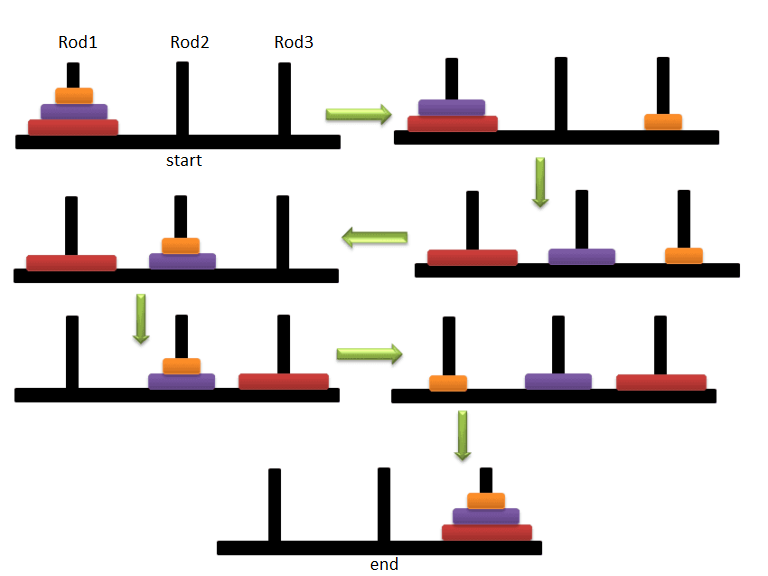
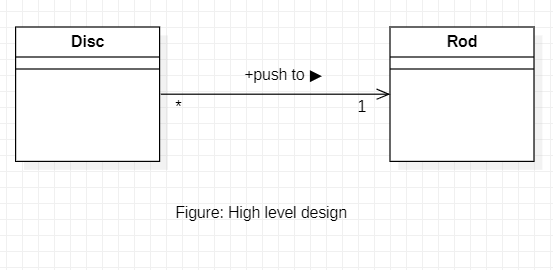
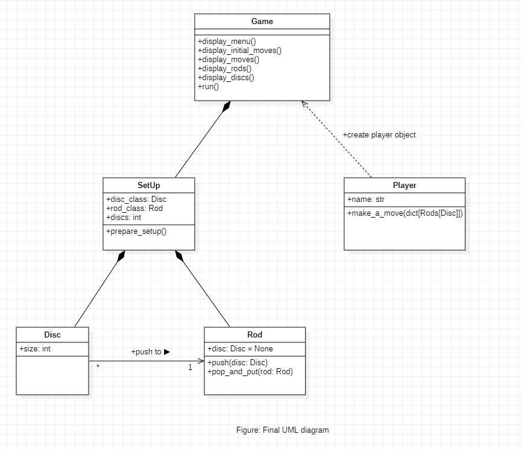
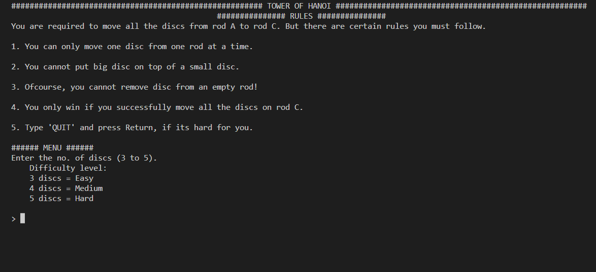
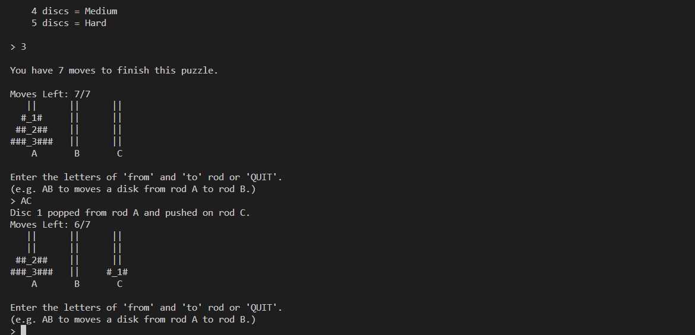
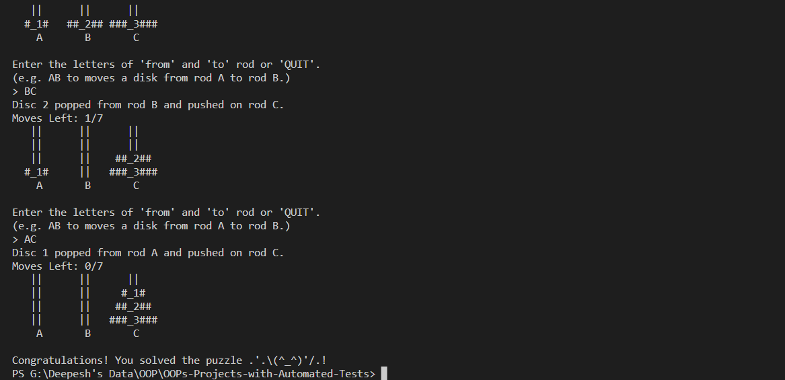

# Towers of Hanoi
In this project, I have turned the famous Towers of Hanoi problem into a very interactive game using Object Oriented Programming and Functional Programming. Also, tested the functionality of program with the help of `pytest` library.

## Project Procedure
- [Problem Description](#description)
- [Object Oriented Analysis (OOA)](#ooa)
    - Identifying the objects and interactions
    - Result of OOA stage
- [Object Oriented Design (OOD)](#ood)
    - High level design
    - Identifying the Attributes and Methods
    - UML Diagram
    - Result of OOD stage
- [Object Oriented Programming (OOP)](#oop)
    - Documentation
    - Examples
- [Testing](#testing)
    - Testing error raise
    - Testing objects
    - Testing functionality of playgame.py
- [Demonstration](#demo)
- [Things that I learnt from this Project](#lessons)

<a name = "description">
<h1> Problem Description</h1>
</a>

Towers of Hanoi is a mathematical puzzle where we are given three rods (**A**, **B**, and **C**) and **N** of disks. Initially, all the discs are stacked in their decreasing size such that, the largest disc is at the bottom of rod and the smallest disc is at the top.

The objective of the puzzle is to move the entire stack of disc from rod **A** to rod **C** using rod **B** as auxiliary rod, obeying the following simple rules:
- Only one disc can be moved at a time.
- Each move consists of taking the upper disk from one of the rods and placing it on top of another rod i.e. a disc can only be moved if it is the uppermost disc on a stack.
- No disc may be placed on top of a smaller disc.



*Figure. Towers of Hanoi*

<a name = "ooa">
<h1> Object Oriented Analysis (OOA)</h1>
</a>
Now that we are familiar with the problem, let's analyse the problem and look it from the Object Oriented point of view. This stage is known as Object Oriented Analysis (OOA). We just simply see the problem and identify the objects and the interface of the problem.

## Identifying the objects
The problem has 5 objects:
- Rods
- Discs
- Player
- Game Set up
- Game (engine object, that will run the game)

The problem has the following interface:
- Discs are put on Rods.
- Discs are removed from Rods.
- Small disc cannot be put on large disc.
- Goal is to stack all the discs on Rod 'C' in correct order.

## Result of the OOA stage
From the OOA stage we have got the description of the system that needs to be built. We determined that we need following five type of objects: 
- Rod object to replicate real world rod object, 
- Disc object to replicate a real world disc object, 
- Player object that will interact with the Game interface, 
- The game initial set up, 
- Lastly, the Game object which will act as an engine to combine all this objects and run our game. 

We also determined the behaviors on the objects, and which object activate a certain behavior on what object.

<a name = "ood">
<h1> Object Oriented Design (OOD)</h1>
</a>
In the OOA stage, we came up with the high level description of the system we are required to build. Now, let's use that description and transform it into requirements for our program.

## High level design
With the above description of the system, our high level design looks like this:


Since, there are tree **Rods** and N number of **Discs**, we are required to make two classes. Class **Rod** and class **Disc**. The above UML diagram shows that the object of class Disc is pushed to an object of class Rod.
The '*' beside the Disc class and '1' beside the Rod class tells that, **many** object of Disc class can be pushed to **one** object of Rod class, respectively.

After creating these two class, we can use their objects in another class **SetUp**, to form the initial setup of the game. You can see that both the **Rod** class and the **Disc** class are in composite relationship with the **SetUp** class, that is because, the **SetUp** class is composed of both the classes.

Then we have, **Player** which is in dependence relationship with the **Game** class, that is, object of type **Player** is created by **Game** class. And the **Player** object interacts with the **Game** interface.

Lastly, we have the **Game** class which combines all the objects and run the game. You can see the **SetUp** class is in composite relationship with it.

Now, let's move further and see what kind of attributes and methods we can define on these classes.

## Identifying the Attributes and Methods
### 1. `Disc` class
#### Attributes:
**`size`**: The class `Disc` can have a `size` attribute since, all the discs are of different size.

### 2. `Rod` class
#### Attributes:
**`rod_name`**: The class `Rod` can have a `rod_name` attribute to identify which rod it is. 

**`disc`**: Also class `Rod` can have a `disc` attribute which is the object of `Disc` type to be pushed into the rod.

#### Methods:
**`push()`**: Since, we are required to push discs in the rods, the `Rod` class can have a `push()` which takes a object of type `Disc` and push it to the rod. This method is only activated by an object of `Disc` type on the rod.

**`pop_and_put()`**: Also, we are required to move disc from one rod to another rod. For that, we can have another method `pop_and_put()` in the `Rod` class to pop the disc from given rod and push it to another Rod type object. It takes an object of `Rod` type as an argument to which we want to push.

### 3. SetUp class
#### Attributes:
**`disc_class`**: The `Disc` class itself to create objects of type `Disc` for building the game setup.

**`rod_class`**: The `Rod` class to create the objects of type `Rod` for building the game setup.

**`discs`**: An integer attribute which represents the number of `Disc` type object to be created and pushed on the `Rod` type object to build the game setup.

#### Methods:
**`prepare_setup()`**: It is the method that will use the attributes and build the setup of game.

### 4. Player class:
#### Attributes:
**`name`**: A `str` attribute to hold the name of the player.

#### Methods:
**`make_a_move()`**: This method asks the player to make a move. This method is how the player will interact with the game interface.

### 5. Game class:
#### Methods:
**`display_menu()`**: Displays the menu and asks the user for their name.

**`display_initial_moves()`**: Displays the initial number of moves the player has, and also displays the number of maximum moves the player has to finish the puzzle successfully.

**`display_moves()`**: Displays the current moves left for the player to finish the puzzle.

**`display_rods()`**: Displays the rods, if they have no disc or have discs.

**`display_discs()`**: Displays the discs on the rod if the rod is not empty.

**`run()`**: Combines all the objects and functionality and run the game.

### The updated UML diagram
Now, our UML diagram looks like this:



### Result of OOD stage
As a result of OOD stage, we discovered: what classes we need to implement for our system. We also discovered the associated attributes and methods for the respective classes. We now have the requirements for our Object Oriented Programming stage. We can now implement these classes in any Object Oriented language, we will use Python.

<a name = "oop">
<h1> Object Oriented Programming (OOP)</h1>
</a>

## Documentation
### *class* `Disc` 
A class to construct an object of `Disc` type.

**Parameters:**\
**size**: ***int type***\
            It represents the size of the disc object.


### *class* `Rod`
The **`Rod`** class extends the buit-in `List` class.

**Parameters:**\
**name**: ***str type***\
            It represents the name of the rod object.

**disc**: ***object of Disc type***\
The disc which will be pushed into the given rod object.

**Methods:**\
**push()**: ***arguments: object of Disc type***\
Takes an object of type `Disc` and push it to the object of `Rod` class. This method is only activated by an object of `Disc` type on the rod.

**pop_and_put()**: ***arguments: object of Rod type***\
Pops the disc from *`self`* and push it to given `Rod` type object.

### *class* `SetUp`
The class to prepare the initial set up of the game.

**Parameters:**\
**n**: ***int type***\
The number of discs/level.

**disc_class**: ***class Disc type***\
The class to construct disc objects to be pushed into the rod 'A' to prepare set up.

**rod_class**: ***class Rod type***\
The class to construct rod objects for the game set up.

**Methods:**\
**prepare_setup()**: 
This method prepares the initial setup of game, with all discs on rod 'A' in decreasing order of size.

### *class* `Player`
A class to create player object with name attribute. And a method to make moves in the game.

**Parameters:**\
**name**: ***str type***\
Name of player.

**Methods:**\
**make_a_move()**: ***arguments: towers: dict[str: Rod]*** 
This method allows the player to make a move in the game, when asked.

***Returns***: A tuple of two rods.

### *class* `Game`
A class to create Game object, combines all the other objects, provides method to display the game set up on user screen and also runs the game with user interaction.

**Methods:**\
**display_menu()**:\
This method shows the menu on the player's screen and asks the player to enter difficulty level and their name to create a player object. 

***Returns***: A tuple of size two, containing level (number of discs basically) and player object.

**display_initial_moves()**:\
This method shows the player the maximum number of moves to finish the puzzle successfully.

**display_moves()**: ***arguments: level: int, tower: dict[str, Rod]***\
This method shows the number of moves left to finish the puzzle.

**display_rods()**: ***arguments: level: int, rods: dict[str, Rod]***\
This method displays the rods with or without discs on the user screen.

**display_discs()**: ***arguments: width: int, level: int***\
This method helps the `display_rods()` method to display discs on the rod.

**run()**:\
This method combines all the objects of other classes and runs the game.


### Exceptions
#### `TypeError`
This exception is raised when a parameter is passed in the `Rod` class which is not of type `Disc`.

#### `InvalidMove`
This is a custom exception class, which is raised when the user tries to push the small disc on top of large disc in the rod.

#### `IndexError`
This exception is raised when the user tries to pop from a rod object which is empty.

\#Note: Later we use these exceptions in our user interface to show warning messages to the user.

## Examples:
Pushing disc in a rod.
```py
# instantiating object of Disc
# setting size parameter as 1
d1 = Disc(size=1)

# instantiating object of Rod
# setting name parameter as 'A'
rod1 = Rod(name='A')

# pushing d1 in rod1
rod1.push(d1)
```
**Output**
```
 Rod A: [1]
```

Popping disc from rod and putting on other rod.
```py
# instantiating two Disc objects
d1 = Disc(size=1)
d2 = Disc(size=2)

# instantiating two Rod objects
rod1 = Rod(name='A')
rod2 = Rod(name='B')

# pushing d2 in rod1
rod1.push(d2)
# pushing d2 in rod1
rod1.push(d1)

# popping from rod1 and putting on rod2
rod1.pop_and_put(rod2)
```
**Output**
```
Rod A: [2]
Rod A: [2, 1]
Rod B: [1]
Disc 1 popped from rod A and pushed on rod B.
```

<a name = "testing">
<h1> Testing </h1>
</a>

For testing our programs I have used **`pytest`** library. 
### Testing error raise
```py
import pytest
from towerofhanoi import Disc, Rod, InvalidMove

# Testing Errors raises in towerofhanoi.py
@pytest.fixture
def rod_object():
    """This fixture is expected to raise error"""
    rod = Rod('A')
    return rod
```
We create a fixture to instantiate an object of class `Rod` for testing error raises (to check if the exceptions we have defined in the program raise correctly or not)

#### Testing TypeError
```py
@pytest.mark.parametrize("val", [10,20,100,300, Disc(2)])
def test_type_error(rod_object, val) -> None:
    """This is expected to raise error"""
    try:
        rod_object.push(val)
    except TypeError:
        # asserting True if the TypeError is raised
        assert True
```
The above code will test if pushing an `int` type object will raise a `TypeError` or not. Since, we expect our test to raise the error, it will pass if the `TypeError` does raise. We have passed a parameter list which consists of 4 `int` objects and 1 `Disc` type object, the test will pass for the `int` values since they will raise `TypeError` and fail for the `Disc` type.

#### Testing Push method 1
```py
@pytest.mark.parametrize("val", [Disc(2), Disc(3), Disc(100)])
def test_push_method1(rod_object, val) -> None:
    rod_object.push(val)
    assert isinstance(rod_object[0], Disc)

```
The above test code will check if the `rod_object` consists an object of `Disc` type. Since in the parameter list we are passing only `Disc` type objects. This test will pass for all parameters.

#### Testing Push method 2
```py
def test_push_method(rod_object) -> None:
    try:
        # pushing disc of size 1 in rod object
        rod_object.push(Disc(1))

        # pushing disc of size 2 in the same rod
        # this is expected to raise InvalidMove error
        rod_object.push(Disc(2))

    except InvalidMove:
        # asserting True if the InvalidMove error is raised
        assert True
```
The above code tests the raising of `InvalidMove` error. Since, we are trying to push a bigger size disc on top of small disc, we expect this to raise `InvalidMove` error. If it does raise this error, the test will pass.

#### Testing  IndexError
```py
def test_pop_and_put_method() -> None:
    try:
        disc1 = Disc(1)
        disc2 = Disc(2)
        rod1 = Rod('A')
        rod2 = Rod('B')
        rod3 = Rod('C')
        
        rod1.push(disc2)
        rod1.push(disc1)

        rod1.pop_and_put(rod2)
        rod1.pop_and_put(rod3)
        rod1.pop_and_put(rod2)

        assert True

    except IndexError:
        assert True

    else:
        assert False
```
The above code tests the raising of `IndexError`. If the user calls `pop_and_put(rod)` method on an empty rod object. This is expected to raise `IndexError` if the error does raise, the test will pass. The test will also pass if the user doesn't raise the error. The test will fail otherwize.

#### Testing SetUp class
```py
 """ This test checks the SetUp"""
    # it takes 3 parameters
    # n : Number of discs
    # disc_class : Disc
    # rod_class : Rod
    # and its prepare_setup() method prepares
    # the initial setup of game
    number_of_discs = 3
    setUp = SetUp(n=number_of_discs, disc_class=Disc, rod_class=Rod)
    towers = setUp.prepare_setup()

    assert isinstance(towers, dict)
    assert isinstance(towers['A'], Rod)
    assert len(towers['A']) == number_of_discs
    assert len(towers['B']) == 0
    assert len(towers['C']) == 0
```
In the above code, we are testing the functionality of the `prepare_setup()` method, which prepares the initial setup for the game. We are testing the following things:
- if the return type of the method is of `dict` type.
- if the item in the `dict` is a `Rod` type.
- if the rod A in the output dict is filled and all other rods (B and C) are empty.

#### Testing make_a_move() method in Player class
```py
# We create a fixture first
@pytest.fixture
def setup():
    """this fixture creates a setup object"""
    setUp = SetUp(n=3, disc_class=Disc, rod_class=Rod)
    towers = setUp.prepare_setup()
    return towers

# testing make_a_move method
def test_make_a_move_method(setup) -> None:
    player = Player(name='Jack Sparrow')
    
    rod1, rod2 = player.make_a_move(setup)
    
    # checking the return type of method
    assert isinstance(player.make_a_move(setup), tuple)

    # checking the type of the value in tuple returned
    assert isinstance(rod1, Rod)
    assert isinstance(rod2, Rod)

    # checking the length of the tuple returned
    assert len(player.make_a_move(setup)) == 2
```
In the above code, we are testing the functionality of `make_a_move()` method of `Player` class. We are testing following things:
- if the return type of the function is a `tuple`.
- if the `rod1` object in the tuple is object of `Rod`
- if the `rod2` object in the tuple is object of `Rod`
- if the length of the returned object is 2

#### Testing display_menu() method of Game class
```py
# testing the display_menu() method of Game class
def test_display_menu(setup) -> None:
    g = Game

    # takes input from the user and returns values
    level, player = g.display_menu(g)

    assert len(g.display_menu(g)) == 2
    assert isinstance(level, int)
    assert isinstance(player, Player)
```
The above code tests the `display_menu()` method of `Game` class. It calls the method and checks the return value of the method. It checks following things:
- If the return value is tuple type.
- If the size of the tuple is 2.
- If the first value in tuple is `int` type.
- If the second value in the tuple is an object of `Player` class.

#### Testing the whole Game class (Integration Test)
```py
@pytest.fixture
def game_object() -> None:
    g = Game()

    return g

def test_Game_class(game_object: Game) -> None:
    try:
        game_object.run()

    # if the game successfully runs
    # it stops with sys.exit()
    # this test passes
    except SystemExit:
        assert True
```
The above test code, is an integration test of all the other class. We are testing the `Game` class which combines objects of all the other classes run the game. This test passes if the game successfully exits with raise of `SystemExit` exception.

<a name='demo'>
<h1> Demonstration </h1>
</a>
Given below are some of the snapshots of the final output of the progam.

#### The initial state of the game
Here, I have first shown the rules of the game. and a small Menu, to ask the player for the level of difficulty.




#### The state after the user inputs the level of difficulty
After the user inputs the level of difficulty (3 in the snapshot below) the initial state of the game is diplayed as shown below.




#### The final state of the game when user successfully solves the puzzle
After the user successfully solves the puzzle in the given number of moves, by giving their response through keyboard input. They see the following display.



and the game exits successfully with SystemExit.

<a name = 'lessons'>
<h1> Things that I learnt from this project</h1>
</a>

I have acquired the following skills from this project:
- **Object Oriented Designing**: I have learnt how to approach an OOPs project as a step-by-step procedure, by first analysing the problem at hand from object oriented point of view, finding the objects and the relations between those objects.

- **UML Diagrams**: I have learnt how to draw the basic UML diagrams before jumping into programming step. UML diagrams do really makes implementation easy, when we sit and write the code for the Object Oriented Programming project.

- **Exception Handling**: In this project I have used some of the exception classes and also coded my own simple exception `InvalidMove`. Doing this I have developed a good understanding of the concept of Exception Handling.

- **Extending built-in types**: In my project I extended the built-in `list` type for our new class `Rod`. Which makes things quite easy.

- **Unit Testing with `pytest` library**: The most valuable skill I have learnt is unit testing using `pytest` library. Testing my code pointed out a few loopholes in my code which I fixed and ensured that my code is free of bugs.

- **Making highly interactive command line display**: I learnt how we can make our command line prompt interactive and also display our objects on the screen in a simple but interactive way.
