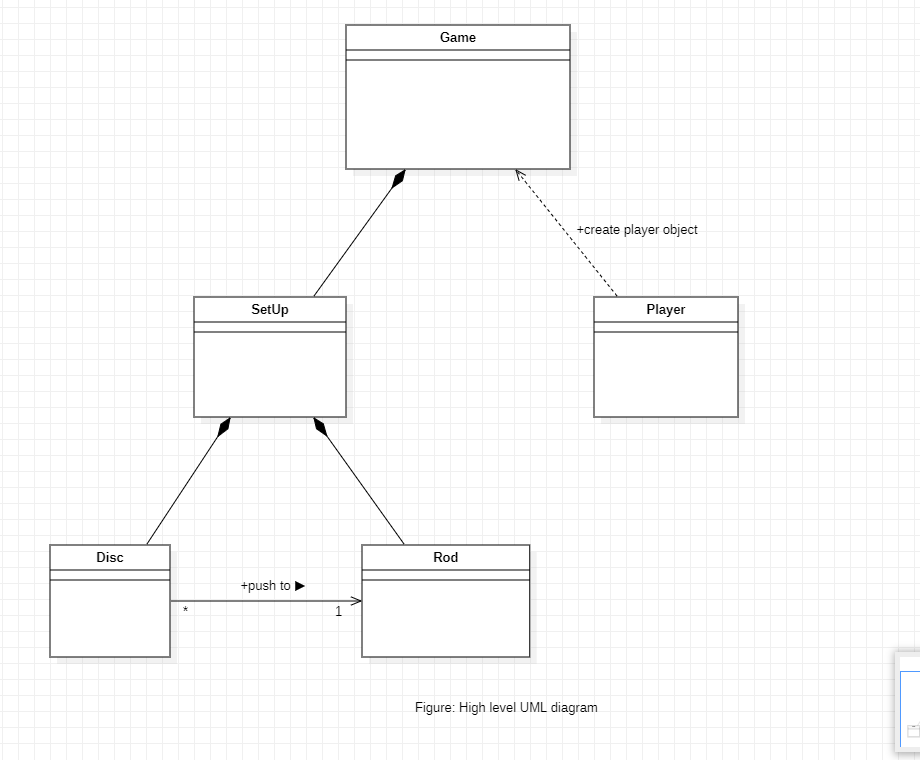

# Towers of Hanoi
In this project, I have turned the famous Towers of Hanoi problem into a very interactive game using Object Oriented Programming and Functional Programming. Also, tested the functionality of program with the help of `pytest` library.

## Project Procedure
- [Problem Description](#description)
- [Object Oriented Analysis (OOA)](#ooa)
    - Identifying the objects and interactions
    - Result of OOA stage
- [Object Oriented Design (OOD)](#ood)
    - High level design
    - Identifying the Attributes and Methods
    - UML Diagram
    - Result of OOD stage
- [Object Oriented Programming (OOP)](#oop)

<a name = "description">
<h1> Problem Description</h1>
</a>

Towers of Hanoi is a mathematical puzzle where we are given three rods (**A**, **B**, and **C**) and **N** of disks. Initially, all the discs are stacked in their decreasing size such that, the largest disc is at the bottom of rod and the smallest disc is at the top.

The objective of the puzzle is to move the entire stack of disc from rod **A** to rod **C** using rod **B** as auxiliary rod, obeying the following simple rules:
- Only one disc can be moved at a time.
- Each move consists of taking the upper disk from one of the rods and placing it on top of another rod i.e. a disc can only be moved if it is the uppermost disc on a stack.
- No disc may be placed on top of a smaller disc.

*Figure. Towers of Hanoi*

<a name = "ooa">
<h1> Object Oriented Analysis (OOA)</h1>
</a>
Now that we are familiar with the problem, let's analyse the problem and look it from the Object Oriented point of view. This stage is known as Object Oriented Analysis (OOA). We just simply see the problem and identify the objects and the interface of the problem.

### Identifying the objects
The problem has two objects:
- Rods
- Discs

The problem has the following interface:
- Discs are put on Rods.
- Discs are removed from Rods.
- Small disc cannot be put on large disc.
- Goal is to stack all the discs on Rod 'C' in correct order.

### Result of the OOA stage
From the OOA stage we have got the description of the system that needs to be built. We determined that we need two type of objects, Rods and Discs. And we also determined the behaviors on the objects, and which object activate a certain behavior on what object.

<a name = "ood">
<h1> Object Oriented Design (OOD)</h1>
</a>
In the OOA stage, we came up with the high level description of the system we are required to build. Now, let's use that description and transform it into requirements for our program.

### High level design
With the above description of the system, our high level design looks like this:

Since, there are tree **Rods** and N number of **Discs**, we are required to make two classes. Class **Rod** and class **Disc**. The above UML diagram shows that the object of class Disc is pushed to an object of class Rod.
The '*' beside the Disc class and '1' beside the Rod class tells that, **many** object of Disc class can be pushed to **one** object of Rod class, respectively.

Now, let's move further and see what kind of attributes and methods we can define on these classes.

### Identifying the Attributes and Methods
#### Attributes:
**`size`**: The class Disc can have a `size` attribute since, all the discs are of different size.

**`name`**: The class Rod can have a `name` attribute to identify which rod it is. 

**`disc`**: Also class Rod can have a `disc` attribute which is the object of Disc type to be pushed into the rod.

#### Methods:
**`push()`**: Since, we are required to push discs in the rods, the Rod class can have a `push()` which takes a object of type Disc and push it to the rod. This method is only activated by an object of Disc type on the rod.

**`pop_and_put()`**: Also, we are required to move disc from one rod to another rod. For that, we can have another method `pop_and_put()` in the Rod class to pop the disc from given rod and push it to another Rod type object. It takes an object of Rod type as an argument to which we want to push.
Now, our UML diagram looks like this:

